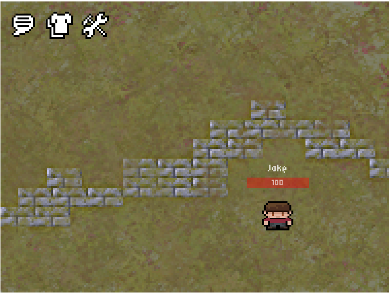

# Variation Jam - Revolution Multiplayer Online

Jake Hayduk

[View this project online](https://jakehayduk.github.io/cart253/variation-jam/)

## Description

To get the full experience, play with someone else, or open a second tab instance in your browser!!!

This is a quiet, chill, pixel art type game, but the catch is that I spent many hours trying to get the multiplayer functionality to work. It's not strictly by the book but I guess you could say that the three variations of the multiplayer form is the gameplay, the wardrobe garments that other people can see on you, and the classic chat area.

> WASD to move, chat and wardrobe in the top left after you log in

> The fights are RNG, so don't get your hopes up about winning!

> Switching tabs makes you fall asleep and so does waiting too long...

## Attribution

> - This project uses [p5.js](https://p5js.org).
> - This project uses jquery
> - This project uses Firebase Live Database